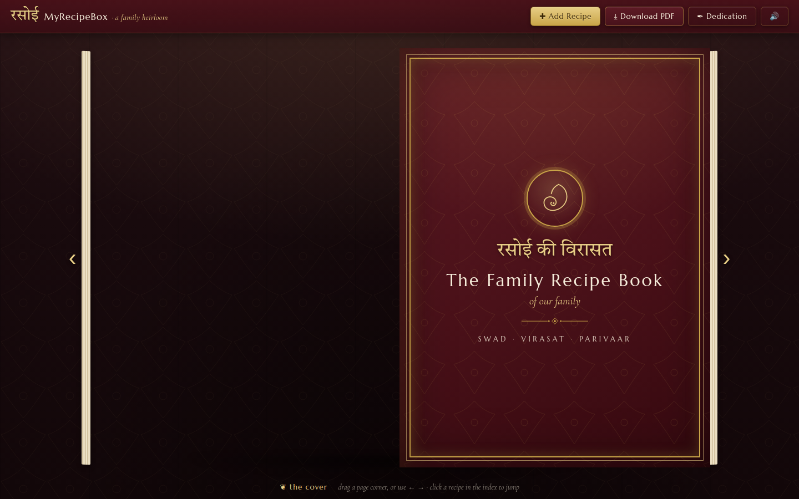
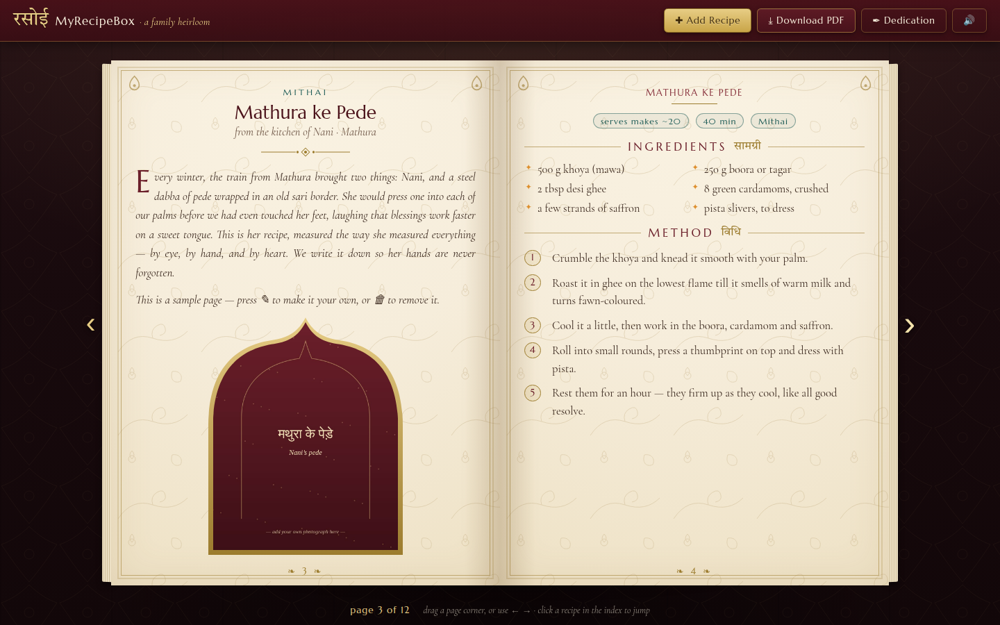
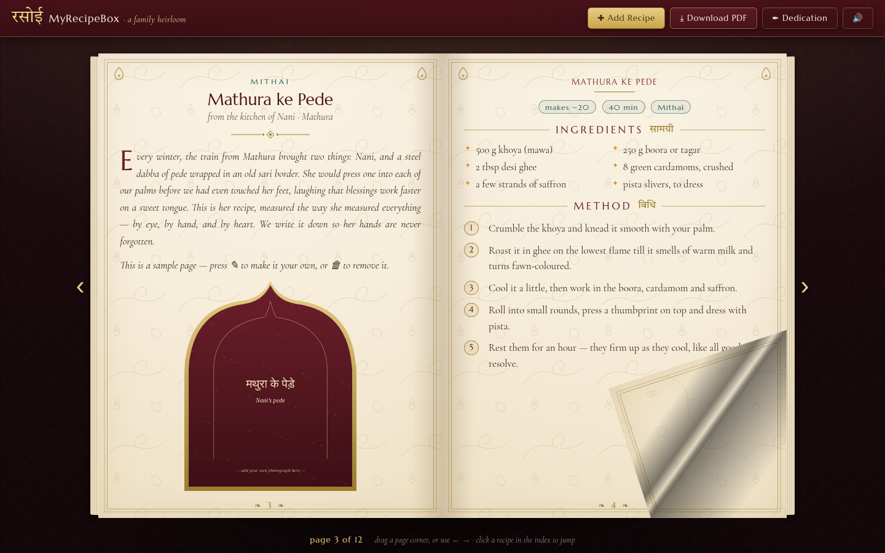

# रसोई की विरासत · MyRecipeBox

A virtual family recipe book — a heavy, leather-bound heirloom you flip through in the
browser, styled after the kitchens and craft of **Uttar Pradesh**: deep Awadhi maroon
leather, zardozi-gold rules, ivory pages washed with a chikankari bel, and photographs
framed in Mughal jharokha arches.



## What it does

- **A real book.** Pages turn with a soft curl — drag a corner and it folds like paper,
  or use the arrows / `←` `→` keys. Hard covers, page-edge stacking, a whispered
  paper *swish* on every turn (mutable with 🔊).
- **Add recipes four ways:**
  - ✍ **Write** — structured fields (name, chapter, serves, time, ingredients, method)
  - 📋 **Paste text** — drop in a whole recipe; headings like *Ingredients / Method /
    सामग्री / विधि* are sorted into the right fields automatically
  - 🎙 **Voice** — speak it (English or हिन्दी) with live transcription, and optionally
    keep the recording itself in the book as a playable *voice memory* — perfect for
    an elder telling the recipe in their own words
  - 📄 **File** — drop `.txt`/`.md` recipe files, audio recordings, or photos
- **The story matters.** Every recipe has a place for *why it's special* — whose kitchen
  it came from, and what it means to your family. The story gets its own page with a
  drop cap, facing the recipe.
- **Photographs** — up to **6 per recipe**, framed in gold jharokha arches; the first
  becomes the story page's hero image, the rest fill a *yaadein* (memories) album page.
- **A living book** — dedication page and family name on the cover (✒ Dedication),
  an *anukramanika* (index) with page numbers you can tap to jump, and Hindi proverbs
  on the filler pages.
- **Download as PDF** — the whole book is pressed into a 6×8″ PDF (cover, dedication,
  index with page numbers, every recipe with its photos) via the ⤓ button.
- **Private by design** — everything is stored locally in your browser (IndexedDB).
  Nothing leaves your machine.




## Running it

It's a fully static site — no build step, no backend.

```bash
# from the repo root — any static server works
python3 -m http.server 8000
# or: npx serve
```

Then open <http://localhost:8000>.

> **Note on the microphone:** browsers only allow mic access on `localhost` or HTTPS,
> so serve the folder rather than double-clicking `index.html` if you want voice input.
> Live transcription uses the Web Speech API (best in Chrome/Edge); in browsers without
> it, the audio recording still works and is kept as a voice memory.

The book ships with two sample UP recipes (Mathura ke Pede, Aloo Rasedar & Bedmi Puri)
so the binding isn't empty — edit them into your own, or remove them with 🗑.

## Project layout

```
index.html          the single page: book stage, add/edit modal, dedication modal
css/style.css       all styling — Awadhi palette, page/cover art, arches, modals
js/app.js           book assembly, measured pagination, flip engine, voice/file intake
js/pdf.js           the PDF binding (jsPDF layouts echoing the on-screen design)
js/db.js            small IndexedDB wrapper (recipes + settings)
vendor/             page-flip (StPageFlip) and jsPDF, vendored
assets/fonts/       Marcellus, Cormorant Garamond, Tiro Devanagari Hindi (self-hosted)
```

## Credits

- Page turning: [StPageFlip](https://github.com/Nodlik/StPageFlip) (MIT)
- PDF: [jsPDF](https://github.com/parallax/jsPDF) (MIT)
- Type: Marcellus, Cormorant Garamond & Tiro Devanagari Hindi via
  [Fontsource](https://fontsource.org) (OFL)
